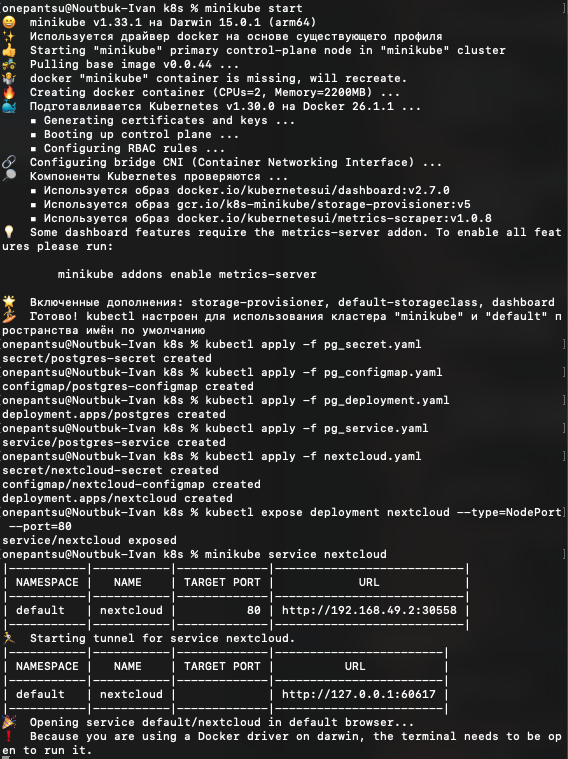
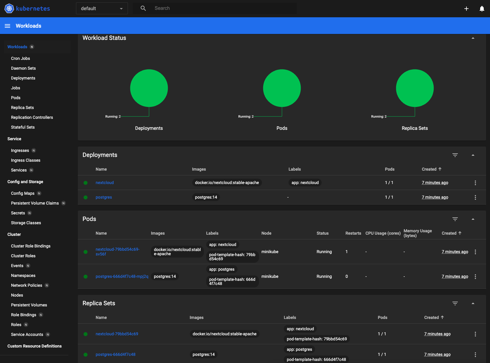
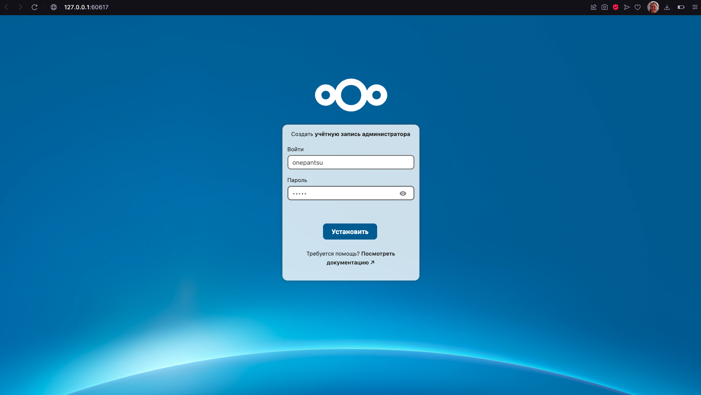

# Kubernetes

## ЛР 3

### В ходе работы выполнено следующее:
- Перенос чувствительных данных из `pg_configmap.yaml` (ConfigMap) в `pg_secret.yaml` (Secret).
- Перенос переменных из Deployment для Nextcloud в ConfigMap и Secret соответственно (всё в рамках файла `nextcloud.yaml`)
- Добавление `livenessProbe` и `readnessProbe` в Deployment для Nextcloud (`nextcloud.yaml`).

### После написания и модификации манифестов выполнены следующие команды в консоли:

### В результате состояние системы отображено в дашборде (`minikube dashboard --url`):

### Интерфейс Nexcloud:

# Ответы на дополнительные вопросы
- ### Важен ли порядок выполнения этих манифестов? Почему?

    Да. Сначала стоит создать ConfigMap и Secret манифесты, так как они содержат переменные среды 
    (Без них Deployment выдаст ошибку). 
    В Service создаётся сеть для доступа к подам, поэтому желательно создавать его до Deployment.
    Следовательно, Deployment стоит создавать самым последним из всех перечисленных объектов.

- ### Что (и почему) произойдет, если отскейлить количество реплик postgres-deployment в 0, затем обратно в 1, после чего попробовать снова зайти на Nextcloud?

    Nextсloud теряет соединение с БД, т.к. все экземпляры Postgres останавливаются. 
    Когда снова появляются реплики Postgres, NextCloud не будет заново пытаться установить соединение с БД.

